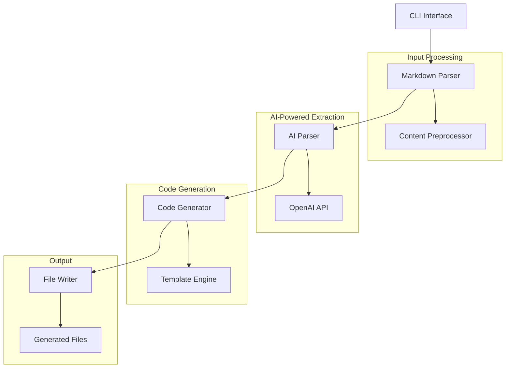

# Design Document

## Overview

The MCP Builder CLI transforms the existing MCP API server into a comprehensive code generation tool. The system will parse API specifications from markdown files containing curl commands, generate MCP server code using templates based on the existing codebase, and leverage AI SDK with OpenAI to optimize and enhance the generated code.

The architecture maintains the existing MCP server structure while adding new CLI capabilities, markdown parsing, code generation, and AI-powered optimization layers.

## Architecture

### High-Level Architecture



### Component Architecture

The system extends the existing MCP server architecture with new components:

1. **CLI Layer**: Command-line interface for user interaction
2. **Parser Layer**: Markdown parsing and content preprocessing
3. **AI Layer**: OpenAI-powered API extraction from curl commands
4. **Generation Layer**: Template-based code generation
5. **Output Layer**: File system operations and project scaffolding

## Components and Interfaces

### 1. CLI Interface (`src/cli/`)

**Purpose**: Provides command-line interface for the MCP builder functionality.

**Key Components**:
- `cli-main.ts`: Main CLI entry point and argument parsing
- `cli-commands.ts`: Command handlers (generate, validate, etc.)
- `cli-config.ts`: Configuration management and validation

**Interface**:
```typescript
interface CLIOptions {
  input: string;           // Path to API markdown file
  output: string;          // Output directory for generated code
  name?: string;           // Generated MCP server name
  openaiApiKey?: string;   // OpenAI API key for parsing
  debug?: boolean;         // Debug logging
  template?: string;       // Custom template directory
  model?: string;          // OpenAI model to use (default: gpt-4)
}

interface CLICommand {
  name: string;
  description: string;
  handler: (options: CLIOptions) => Promise<void>;
}
```

### 2. Markdown Parser (`src/parser/`)

**Purpose**: Parses markdown files and prepares content for AI-powered API extraction.

**Key Components**:
- `markdown-parser.ts`: Basic markdown parsing and structure extraction
- `content-preprocessor.ts`: Prepares markdown content for AI analysis
- `api-spec-validator.ts`: Validates AI-extracted API specifications

**Interface**:
```typescript
interface APISpec {
  name: string;
  description?: string;
  method: HTTPMethod;
  url: string;
  headers?: Record<string, string>;
  body?: string | object;
  parameters?: APIParameter[];
  examples?: APIExample[];
  curlCommand?: string;
}

interface APIParameter {
  name: string;
  type: 'string' | 'number' | 'boolean' | 'object' | 'array';
  required: boolean;
  description?: string;
  location: 'query' | 'header' | 'body' | 'path';
  example?: any;
}

interface ParsedAPICollection {
  name: string;
  description?: string;
  baseUrl?: string;
  apis: APISpec[];
  rawMarkdown: string;
}
```

### 3. Code Generator (`src/generator/`)

**Purpose**: Generates MCP server code using templates based on parsed API specifications.

**Key Components**:
- `code-generator.ts`: Main code generation orchestrator
- `template-engine.ts`: Template processing and rendering
- `mcp-tool-generator.ts`: Generates MCP tool definitions
- `server-generator.ts`: Generates main server code

**Interface**:
```typescript
interface GenerationContext {
  apiCollection: ParsedAPICollection;
  serverName: string;
  outputDir: string;
  templateDir?: string;
  options: GenerationOptions;
}

interface GenerationOptions {
  includeTests: boolean;
  includeDocumentation: boolean;
  typescript: boolean;
  aiParsing: boolean;
}

interface GeneratedFile {
  path: string;
  content: string;
  type: 'source' | 'test' | 'config' | 'documentation';
}
```

### 4. AI Parser (`src/ai/`)

**Purpose**: Uses OpenAI API to intelligently parse markdown content and extract API specifications from curl commands.

**Key Components**:
- `ai-parser.ts`: Main AI parsing orchestrator
- `openai-client.ts`: OpenAI API client wrapper
- `curl-analyzer.ts`: AI-powered curl command analysis
- `api-extractor.ts`: Intelligent API specification extraction

**Interface**:
```typescript
interface AIParsingRequest {
  markdown: string;
  context?: ParsingContext;
}

interface ParsingContext {
  baseUrl?: string;
  commonHeaders?: Record<string, string>;
  apiName?: string;
  expectedEndpoints?: number;
}

interface AIParsingResult {
  apis: APISpec[];
  metadata: APIMetadata;
  confidence: number;
  warnings: string[];
}

interface APIMetadata {
  name: string;
  description?: string;
  baseUrl?: string;
  authentication?: AuthenticationSpec;
  commonHeaders?: Record<string, string>;
}
```

### 5. Template System (`templates/`)

**Purpose**: Provides reusable templates for generating different types of MCP server code.

**Template Structure**:
```
templates/
├── base/
│   ├── package.json.hbs
│   ├── tsconfig.json.hbs
│   ├── README.md.hbs
│   └── .gitignore.hbs
├── src/
│   ├── index.ts.hbs
│   ├── mcp-server.ts.hbs
│   ├── tools.ts.hbs
│   ├── types.ts.hbs
│   ├── api-client.ts.hbs
│   └── request-validator.ts.hbs
├── tests/
│   └── tool-tests.ts.hbs
└── docs/
    └── api-documentation.md.hbs
```

## Data Models

### Core Data Models

```typescript
// Extended from existing types.ts
interface GeneratedMCPServer {
  name: string;
  version: string;
  description: string;
  tools: GeneratedMCPTool[];
  configuration: ServerConfiguration;
  dependencies: PackageDependency[];
}

interface GeneratedMCPTool {
  name: string;
  description: string;
  inputSchema: JSONSchema;
  handler: ToolHandler;
  apiSpec: APISpec;
  validation: ValidationRules;
}

interface ServerConfiguration {
  timeout: number;
  maxResponseLength: number;
  allowedHosts: string[];
  security: SecurityConfiguration;
}

interface PackageDependency {
  name: string;
  version: string;
  type: 'dependency' | 'devDependency';
}
```

### Template Data Models

```typescript
interface TemplateContext {
  server: GeneratedMCPServer;
  tools: GeneratedMCPTool[];
  imports: ImportStatement[];
  exports: ExportStatement[];
  metadata: ProjectMetadata;
}

interface ProjectMetadata {
  generatedAt: string;
  generatedBy: string;
  sourceFile: string;
  version: string;
}
```

## Error Handling

### Error Categories

1. **Input Validation Errors**
   - Invalid markdown format
   - Malformed curl commands
   - Missing required parameters

2. **Generation Errors**
   - Template processing failures
   - File system errors
   - Invalid API specifications

3. **AI Parsing Errors**
   - OpenAI API failures
   - Rate limiting
   - Invalid or incomplete API extraction

4. **Output Errors**
   - File write permissions
   - Directory creation failures
   - Dependency resolution issues

### Error Handling Strategy

```typescript
interface MCPBuilderError {
  type: 'input' | 'generation' | 'ai_parsing' | 'output';
  code: string;
  message: string;
  details?: any;
  suggestions?: string[];
}

class ErrorHandler {
  static handle(error: MCPBuilderError): void;
  static recover(error: MCPBuilderError): boolean;
  static suggest(error: MCPBuilderError): string[];
}
```

## Testing Strategy

### Unit Testing

1. **Parser Tests**
   - Markdown parsing accuracy
   - Curl command extraction
   - API specification validation

2. **Generator Tests**
   - Template rendering
   - Code generation accuracy
   - File structure validation

3. **AI Integration Tests**
   - OpenAI API mocking
   - Optimization result validation
   - Error handling

### Integration Testing

1. **End-to-End Tests**
   - Complete CLI workflow
   - Generated code compilation
   - MCP server functionality

2. **Template Tests**
   - Template rendering with various inputs
   - Generated code syntax validation
   - Dependency resolution

### Test Data

```typescript
interface TestAPICollection {
  name: string;
  markdown: string;
  expectedAPIs: APISpec[];
  expectedTools: GeneratedMCPTool[];
}

const TEST_CASES: TestAPICollection[] = [
  {
    name: "Simple REST API",
    markdown: `
# User API

## Get User
\`\`\`bash
curl -X GET "https://api.example.com/users/123" \\
  -H "Authorization: Bearer token"
\`\`\`

## Create User
\`\`\`bash
curl -X POST "https://api.example.com/users" \\
  -H "Content-Type: application/json" \\
  -d '{"name": "John", "email": "john@example.com"}'
\`\`\`
    `,
    expectedAPIs: [/* ... */],
    expectedTools: [/* ... */]
  }
];
```

## AI Integration Details

### OpenAI Integration for API Parsing

The system uses OpenAI's GPT models to intelligently parse markdown content and extract API specifications from curl commands:

```typescript
interface AIPromptTemplate {
  system: string;
  user: string;
  examples?: PromptExample[];
}

const API_EXTRACTION_PROMPT: AIPromptTemplate = {
  system: `You are an expert API analyst. Parse markdown content containing curl commands and extract structured API specifications. 
           Focus on accuracy and completeness of the extracted information.`,
  user: `Please analyze this markdown content and extract API specifications:
         
         Markdown Content: {{markdown}}
         
         Extract:
         1. API endpoint names and descriptions
         2. HTTP methods and URLs
         3. Headers and authentication
         4. Request bodies and parameters
         5. Response examples if available
         
         Return a structured JSON response with the API specifications.`
};
```

### AI Parsing Strategies

1. **Curl Command Analysis**
   - Extract HTTP method, URL, headers, and body
   - Identify authentication patterns
   - Parse query parameters and path variables

2. **Context Understanding**
   - Infer API names from markdown headings
   - Extract descriptions from surrounding text
   - Identify common patterns and base URLs

3. **Parameter Inference**
   - Determine parameter types from examples
   - Identify required vs optional parameters
   - Extract validation rules from curl examples

4. **Error Recovery**
   - Handle malformed curl commands
   - Suggest corrections for common issues
   - Provide confidence scores for extractions

### AI Response Processing

```typescript
interface AIExtractionResponse {
  apis: {
    name: string;
    description?: string;
    method: string;
    url: string;
    headers?: Record<string, string>;
    body?: any;
    parameters?: {
      name: string;
      type: string;
      required: boolean;
      location: string;
      description?: string;
    }[];
  }[];
  metadata: {
    baseUrl?: string;
    authentication?: {
      type: 'bearer' | 'basic' | 'apikey';
      location?: 'header' | 'query';
      name?: string;
    };
    commonHeaders?: Record<string, string>;
  };
  confidence: number;
  warnings: string[];
}
```